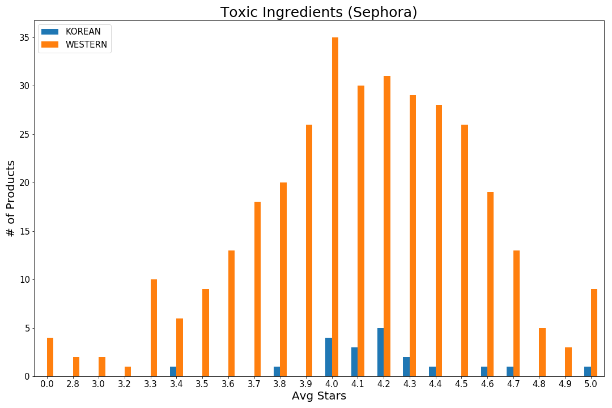
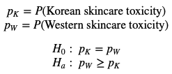
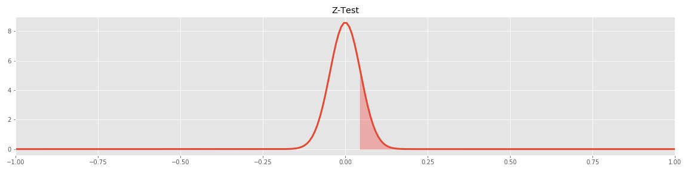
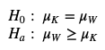
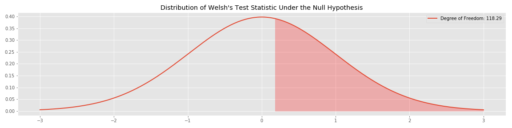

# Which is better? Korean vs Western Skincare

# Goal:

With all the craze behind Korean skincare, you wonder if there is a "success" formula to it all. The overarching goal for this project was to identify potentially hazardous ingredients in skincare products that would help quantify whether or not Korean ones are better than Western ones. 

# Data Processing:

The potentially hazardous skincare ingredients were extracted from the California Safe Cosmetics Program (CSCP) dataset from the California Deparment of Public Health. The CSCP dataset lists all cosmetic products sold in California that contain any ingredients known or suspected to cause cancer, birth defects, or other developmental or reproductive harm. The CSCP dataset consists of label names of cosmetic/personal care products, company/manufacturer names, product brand names, product categories, Chemical Abstracts Service registry numbers (CAS#) of the reported chemical ingredients, names of reported chemical ingredients, the number of reported chemicals for each product, and dates of reporting, product discontinuation or reformulation if applicable.

Utilizing a Sephora skincare dataset found on Github, Korean and Western brands were categorized by whether or not a product contained potentially hazardous ingredient found on the CSCP list. The Sephora data contains the product's name, description, brand, ingredients (if available), category, average rating, price, and reviewer's skin type.

# Data Exploration:

**List of Potentially Hazardous Ingredients from CSCP dataset:**

Titanium Dioxide, Benzophenone, Ginkgo Biloba Extract, Coffee, Aloe Vera (Whole Leaf Extract), Caffeic Acid, Butylated Hydroxyanisole, Acetaldehyde, Benzo[A]Pyrene, Benz[A]Anthracene, Estragole, Safrole

**Most Prominent Hazard Chemicals**

The most prominent hazardous chemical in Korean and Western skincare was Titanium Dioxide, an inert earth material used as a thickening, whitening, lubricating, and sunscreen ingredient in cosmetics. This was more prominent in Western brands than Korean ones. The second most prominent chemical was Benzophene, a group of compounds used in cosmetics as sunscreen agenst to protect mostly from UVB radiation and some UVA radiation, found only in Western products. Interestingly, the third most prominent ingredient was Ginkgo Biloba Extract found only in Korean products. This is a potent, plant-derived antioxidant and soothing ingredient derived from the Ginkgo plant. 

**Toxic Skin Products from Sephora**

A graph of the ratio toxic products to total number of product by brand is listed below. The bars highlighted in red are Korean brands, while those in blue are Western ones. The three Korean brands that contained potentially hazardous ingredients had ratios ranging from around 0.2 to 0.3.

Interestingly, the average rating from reviewers for toxic Korean skincare products on Sephora was around 4.23, while the average rating for toxic Western ones was 4.16.

**Hypothesis Testing**

Hypothesis test for this analysis: Is the prevalance of toxic ingredients higher in Western skincare products than Korean ones?

*Z-Test*

Z-Test Null and Alternative Hypothesis:

Null: The prevalance of toxic ingredients is the same in Western skincare products as in Korean ones.

Alternate: The prevalance of toxic ingredients is higher in Western skincare products than Korean ones.

A two sample Z-Test was used to test to see if the prevalance of toxic ingredients higher in Western skincare product that Korean ones. The level of significance was set relatively high at 0.2. The p-value for this test was 0.21. As a result the test failed to reject the null hypothesis.

*T-Test*

T-Test Null and Alternative Hypothesis:

Null: The mean number of products that contain toxic ingredients in Western skincare products is the same as the mean number of products that contain toxic ingredients in Korean skincare products.

Alternate: The mean number of products that contain toxic ingredients in Western skincare products is greater than the mean number of products that contain toxic ingredients in Korean skincare products.

A Welch's T-test was used to test if the means of the two populations were equal. The level of significance was kept at 0.2. The p-value for this test is 0.43. As a result, the test failed to reject the null hypothesis.

A U-Test was performed as well to check if the similar results would be achieved. The p-value using this test was 0.43, confirming that there is not enough statistical evidence to say that Western skincare products have a higher toxicity rate than Korean ones.